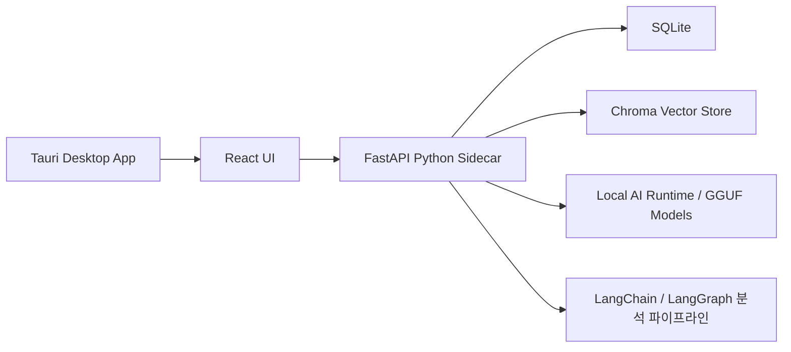

# Story Guard

Story Guard는 웹소설, 장편 소설, 드라마 시나리오처럼 설정과 관계가 길게 누적되는 작품을 위한 로컬 우선 데스크톱 앱입니다. 작가의 원고를 로컬에서 분석해 인물, 장소, 조직, 아이템, 사건, 규칙, 떡밥의 관계를 그래프로 보여주고, 설정 충돌이나 미회수 떡밥 후보를 리포트로 정리합니다.

해커톤 저장소: <https://github.com/wanted-storyguard/StoryGaurd>

## 제출 형태 · 공개 웹 데모 (2026-09-14 결정)

원티드 AI 챔피언십 FAQ(9/10)는 검증되지 않은 설치 파일(exe·dmg) 다운로드를 허용하지 않고, 데스크톱 앱은 스토어 링크 또는 **핵심 기능을 체험할 수 있는 웹 데모 URL**로 제출하도록 안내한다. 팀은 제출물을 웹 데모로 정했고, 데스크톱 앱은 제출 이후에 이어간다.

- 같은 코드베이스를 Tauri 없이 서버에 올린다. 프론트는 정적 빌드, 백엔드는 FastAPI를 **웹 모드**로 실행한다.
- 웹 모드(`STORY_GUARD_WEB_MODE=1`)는 종료·로컬 모델 설치·ChatGPT 로그인·서버 경로 import 같은 데스크톱 전용 API를 403으로 막고, 샘플 작품을 읽기 전용으로 제공한다. 쓰기는 `STORY_GUARD_WEB_WRITE_PATHS` 정규식에 맞는 경로만 허용한다.
- 샘플 작품의 청킹·임베딩·GPT 분석은 로컬에서 미리 돌리고, 그 결과 데이터 폴더(SQLite·Chroma)를 서버의 `STORY_GUARD_DATA_DIR`로 올린다. 서버에는 임베딩 모델을 두지 않는다.
- 라이브 "이 장면 검토"는 서버가 OpenAI API 키로 GPT를 호출하고 사용량·예산을 제한한다. 이 연결 클래스와 제한 계층은 아직 구현 전이다.

웹 모드 로컬 확인:

```powershell
$env:STORY_GUARD_WEB_MODE = "1"
$env:STORY_GUARD_WEB_ORIGINS = "http://localhost:5173"
$env:STORY_GUARD_DATA_DIR = "C:\storyguard-demo-data"
.\.venv\Scripts\python.exe -m backend.app.main
# 다른 창에서: npm run dev  →  http://localhost:5173
```

프로덕션 빌드는 `VITE_STORY_GUARD_API=https://<백엔드 주소> npm run build`로 만든다. 환경변수 전체와 배포 원칙은 [docs/web-demo-server.md](docs/web-demo-server.md)에 있다.

## 빠른 시작

```bash
git clone https://github.com/wanted-storyguard/StoryGaurd.git
cd StoryGaurd
npm install
python3 -m venv .venv
. .venv/bin/activate
pip install -r backend/requirements.txt
npm test -- --run
.venv/bin/python -m pytest -q
npm run build
```

자세한 개발·패키징 절차는 아래의 `개발 환경 실행`과 `데스크톱 앱 빌드`를 따릅니다. 모델 바이너리와 개인 원고는 저장소에 커밋하지 않습니다.

원고와 분석 데이터는 사용자 컴퓨터 안에 저장됩니다. 사용자가 선택해 연결한 GPT 계정으로 분석할 때만 필요한 원문 구간이 해당 제공자에 전송되며, 팀 공용 API 키를 사용하지 않습니다.

## 주요 기능

- `txt`, `md`, `docx` 원고 파일 가져오기
- 한국어 원고 기반 엔티티 추출
- 인물, 장소, 조직, 아이템, 사건, 규칙, 떡밥 그래프 시각화
- 조직을 큰 집합 영역으로 보고 소속 인물, 장소, 사건, 규칙을 내부에 배치하는 그래프 보기
- 핵심 관계/전체 관계 보기 전환
- 분리된 관계망 자동 배치·컴포넌트별 문제 수·문제 관계만 강조
- 중간 회차 공백, 충돌 술어, 끊긴 끝점을 원문 근거와 함께 표시
- 설정 충돌, 시간선 오류, 미회수 떡밥 후보 리포트
- 이슈 상태 관리: 열림, 확정, 무시, 보류
- 앱 관리 로컬 LLM 설치와 분석
- LangChain 기반 chunking/RAG 색인
- LangGraph 스타일 분석 파이프라인
- SQLite와 Chroma를 이용한 로컬 저장

## 기술 스택

- 데스크톱: Tauri v2
- 프론트엔드: React, TypeScript, Vite, Cytoscape
- 백엔드: Python, FastAPI
- 데이터 저장: SQLite, Chroma
- 로컬 AI: llama.cpp, GGUF 로컬 모델, LangChain, LangGraph
- 패키징: PyInstaller sidecar, Tauri bundle

## 동작 구조



분석 흐름은 대략 다음 순서로 진행됩니다.


## 보안과 프라이버시

- 원고 본문, chunk, 엔티티, 관계, 이슈는 로컬 앱 데이터 디렉터리에 저장됩니다.
- 로컬 분석은 앱 데이터 디렉터리에 설치된 로컬 GGUF 모델로 동작합니다.
- 사용자가 GPT 계정을 연결한 경우에는 선택한 GPT 모델로 분석할 수 있습니다. 이 경로는 원문 전송과 사용량이 발생하므로 실행 전에 안내합니다.
- 로컬 생성 모델이 없으면 로컬 분석만 비활성화하고, GPT 연결이 준비된 경우에는 GPT 분석을 사용할 수 있습니다.
- 데스크톱 앱은 FastAPI sidecar를 `127.0.0.1`에만 바인딩합니다.
- 데스크톱 실행 시 Tauri가 로컬 API 토큰을 앱 데이터 디렉터리에 저장하고, sidecar API 요청에 토큰을 붙입니다.
- `/health`를 제외한 API는 토큰이 설정된 경우 토큰 없이 접근할 수 없고, 앱 시작 준비 확인은 인증된 `/health/ready`로 수행합니다.
- 기본 모델 설치는 공개 모델 파일 다운로드만 수행하며, 원고 본문은 외부로 전송하지 않습니다.

주의: 개발 모드에서는 별도 backend 서버를 직접 띄울 수 있으므로, 공개 네트워크 인터페이스에 backend를 바인딩하지 마세요.

## 요구 사항

- macOS
- Node.js 20 이상 권장
- Python 3.11
- Rust/Cargo
- 기본 로컬 생성 모델: `qwen2.5-1.5b-instruct-q4_k_m.gguf`
- 로컬 임베딩 모델 선택지: Qwen3 Embedding 0.6B 또는 EmbeddingGemma 300M
- 기본 모델 출처: `Qwen/Qwen2.5-1.5B-Instruct-GGUF`
- 런타임: `llama-cpp-python`

앱의 `LLM 설치` 버튼은 기본 GGUF 생성 모델을 앱 데이터 디렉터리의 `models/` 폴더에 내려받습니다. 임베딩 모델도 환경 설정에서 별도로 준비하며, 다른 GGUF 생성 모델을 사용할 때는 같은 폴더에 파일을 넣고 생성 모델 선택에서 고릅니다.

## 개발 환경 실행

의존성 설치:

```bash
npm install
python3 -m venv .venv
. .venv/bin/activate
pip install -r backend/requirements.txt
```

백엔드 실행:

```bash
npm run backend
```

프론트엔드 실행:

```bash
npm run dev
```

Tauri 개발 실행:

```bash
npm run tauri -- dev
```

## 데스크톱 앱 빌드

Python sidecar 빌드:

```bash
./scripts/build-backend-sidecar.sh
```

Windows PowerShell에서는 다음 명령으로 동일한 sidecar를 만듭니다.

```powershell
.venv\Scripts\python.exe -m pip install -r backend\requirements.txt
.\scripts\build-backend-sidecar.ps1
```

Windows 빌드는 `src-tauri\binaries\story-guard-backend-x86_64-pc-windows-msvc.exe`를 생성한 뒤 Tauri 빌드를 실행합니다. 실제 Windows 설치·실행은 Windows 장비에서 별도로 확인해야 합니다.

저장소의 `Windows release candidate` GitHub Actions를 수동 실행하거나 `v*` 태그를 push하면 Windows runner에서 sidecar 빌드, 프론트·백엔드 테스트, NSIS 설치 파일 생성을 자동으로 수행합니다. Windows 장비에서 생성된 파일의 크기와 SHA-256은 다음 명령으로 확인합니다.

```powershell
.\scripts\verify-windows-artifacts.ps1
```

Tauri 앱 빌드:

```bash
npm run tauri -- build
```

macOS 앱 번들은 다음 위치에 생성됩니다.

```text
src-tauri/target/release/bundle/macos/Story Guard.app
```

기본 Tauri DMG 생성은 GUI 장식 단계가 필요한 환경에서 실패할 수 있습니다. 비GUI 환경에서는 다음 재현 스크립트를 사용합니다.

```bash
./scripts/build-macos-dmg.sh
```

설치 후보 DMG는 다음 위치에 생성됩니다.

```text
output/releases/Story Guard_0.1.0_arm64.dmg
```

파일명·SHA-256·서명 상태는 `output/releases/release.json`에서 확인합니다.

DMG를 열고 `Story Guard.app`을 `Applications`로 드래그해 설치합니다. 현재 배포 후보는 Apple Silicon arm64용이며, Finder 창의 아이콘 위치 장식은 비GUI 빌드에서 생략됩니다.

## 테스트

백엔드 테스트:

```bash
.venv/bin/pytest -q
```

테스트는 임시 `STORY_GUARD_DATA_DIR`를 자동으로 사용하므로 개발자의 실제 작품·분석 DB를 건드리지 않습니다.

프론트엔드 테스트:

```bash
npm test -- --run
```

프론트엔드 빌드:

```bash
npm run build
```

Rust/Tauri 확인:

```bash
cargo check --manifest-path src-tauri/Cargo.toml
```

보안 audit:

```bash
npm audit --audit-level=moderate
```

## 저장 위치

데스크톱 앱 실행 시 데이터는 Tauri 앱 데이터 디렉터리에 저장됩니다. 개발 모드에서는 기본적으로 홈 디렉터리의 `.story-guard`를 사용하거나, `STORY_GUARD_DATA_DIR` 환경변수로 바꿀 수 있습니다.

```bash
STORY_GUARD_DATA_DIR=/tmp/story-guard-dev npm run backend
```

저장되는 주요 데이터:

- SQLite DB: 프로젝트, 원고, 엔티티, 관계, 이슈, 설정
- Chroma index: 원고 chunk embedding
- 원고 본문: SQLite documents 테이블

## 샘플 원고

`samples/` 폴더에는 분석 테스트용 한국어 원고가 들어 있습니다.

- `samples/story-guard-model-test.md`
- `samples/generation-model-comparison-test.md`
- `samples/organization-set-view-test.md`: 조직을 큰 집합으로 보고 인물, 장소, 사건, 규칙이 그 안에 속하는 그래프를 확인하기 위한 테스트 원고
- `samples/story-guard-continuity-test.md`
- `samples/multi-episode/`

## 장편 원고 처리 방식

회차 수만으로 처리 시간을 판단하지 않습니다. 회차당 글자 수가 길면 검색 청크와 GPT 검토 구간이 함께 늘어납니다. 예를 들어 현재 Mac에서 실제 EmbeddingGemma 색인은 50만 자에 약 2분 39초, 100만 자(10회×10만 자)에 약 5분 04초가 걸렸습니다. 이 시간은 첫 색인 기준이며 GPT 응답 시간은 별도입니다. 같은 조건에서 11회차를 추가할 때는 새 224청크만 약 30초에 처리하고 기존 벡터를 재사용했습니다. 100만 자 실측에서 Gemma 격리 워커의 최대 RSS는 약 1.66GB였습니다. Qwen은 62,000자·150청크 실측에서 106.9초(초당 1.40청크), 최대 RSS 약 2.27GB였으므로 파일 크기 약 639MB만 보고 장치 부담을 판단하면 안 됩니다. 검색 품질을 우선하면 Qwen, 초기 색인 속도와 메모리를 우선하면 Gemma를 선택하고, 메모리가 제한된 기기는 회차 범위를 나누어 준비해야 합니다.

회차당 10만 자씩 10회를 넣은 스트레스 검증에서는 231개 GPT 검토 구간이 만들어졌습니다. 안내 범위(구간당 15~60초)를 적용하면 GPT 직렬 검토만 약 58~231분으로 계산되므로, 장편 원고는 범위 분석과 완료 구간 재사용을 전제로 사용해야 합니다.

- 첫 분석은 실제 문자 수·청크 수·검토 구간 수와 예상 색인·GPT 시간을 먼저 표시합니다. GPT 시간은 구간당 15~60초 범위의 안내값이며 실제 보장 시간이 아닙니다.
- GPT 검토는 최대 20구간씩 진행하고 완료 구간을 체크포인트로 저장합니다.
- 앱이 닫히거나 요청이 실패하면 성공 구간은 재사용하고 실패·미실행 구간만 이어서 처리합니다.
- 새 회차를 추가하거나 원고를 교체하면 변경된 청크·검토 구간만 다시 처리합니다.
- 수백 회차 원고는 전체를 한 번에 기다리지 않고 회차 범위를 나누어 진행하는 것을 권장합니다.

## 현재 한계

- HWP와 PDF 파싱은 아직 지원하지 않습니다.
- 협업 기능은 없습니다.
- 실시간 집필 감시는 아직 없습니다.
- 분석 품질은 설치된 로컬 LLM 모델과 원고 형식에 영향을 받습니다.
- LLM 추출 결과는 작가가 검토해야 하는 후보입니다. 최종 판정 도구가 아니라 설정 검토 보조 도구입니다.

## AI 에이전트에게 처음 맡길 때

다른 AI 에이전트가 저장소를 처음 다룰 때는 아래 프롬프트를 그대로 입력하면 됩니다.

```text
너는 Story Guard 저장소의 구현·검증 담당자다.
1. README.md와 DESIGN.md, docs/research/를 먼저 읽고 현재 기능과 한계를 요약한다.
2. .gitignore에 포함된 output/, .cache/, .venv/, node_modules/, src-tauri/target/을 추적하거나 커밋하지 않는다.
3. npm install 후 npm test -- --run, .venv/bin/python -m pytest -q, npm run build를 실행한다.
4. 변경 전 현재 테스트를 통과시키고, 변경 후 같은 검증을 다시 실행한다.
5. 원고·분석 DB를 삭제하거나 덮어쓰지 말고 임시 STORY_GUARD_DATA_DIR를 사용한다.
6. 분석 기능을 수정할 때는 성공 구간 재사용, 실패 구간 격리·재시도, 원문 근거 일치를 함께 검증한다.
7. 관계 그래프를 수정할 때는 전체/핵심/점검 필요 필터, 고립·끊긴 관계, 노드 선택과 근거 패널, 줌·이동을 확인한다.
8. 결과 보고에는 실행한 명령, 통과한 테스트 수, 실패 원인, 남은 네이티브 장치 확인을 구분해 기록한다.
코드나 문서를 수정하기 전에 현재 상태와 작업 범위를 먼저 보고하고, 비밀키·원문·모델 바이너리를 커밋하지 않는다.
```

## 공개 저장소에 올리지 않는 것

이 저장소에는 실행에 필요한 소스·설정·테스트·작은 샘플만 포함합니다. 다음은 로컬에서만 생성되며 Git으로 추적하지 않습니다.

- `output/`: 검증 캡처, 대용량 JSON, 빌드·분석 결과
- `.cache/`, `.venv/`, `node_modules/`, `build/`, `dist/`: 모델·의존성·생성물
- `src-tauri/target/`, `src-tauri/binaries/`: 플랫폼별 빌드 산출물과 sidecar
- `.env` 및 토큰·원고 본문·개인 데이터

공개 가능한 검증 절차와 결과 요약은 `docs/research/`에 Markdown으로 남깁니다. 새 원고를 공유할 때는 저작권이 확인된 샘플만 사용합니다.

## 문제 해결 기록

장편 원고 분석에서 확인했던 문제와 대응은 [분석 성능·복구 기록](docs/research/analysis-performance-history.md)에 정리되어 있습니다. 실패한 구간을 전체 실패로 처리하지 않는 이유, 증분 분석과 체크포인트의 동작, 실제 20·50편 측정값을 확인할 수 있습니다.

## GitHub 업로드 주의

다음 파일과 폴더는 커밋하지 않습니다.

- `.venv/`
- `node_modules/`
- `.cargo/`, `.rustup/`
- `build/`, `dist/`, `src-tauri/target/`
- `src-tauri/binaries/story-guard-backend*`
- `.story-guard/`, `chroma/`
- `models/`, `*.gguf`
- `.env*`, `*.sqlite`, `*.db`, 로그 파일

대용량 빌드 산출물과 로컬 원고 데이터가 들어가지 않도록 커밋 전 `git status`를 확인하세요.
